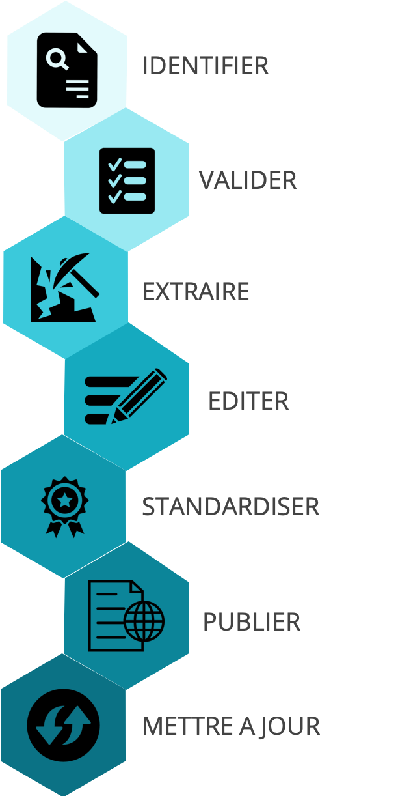
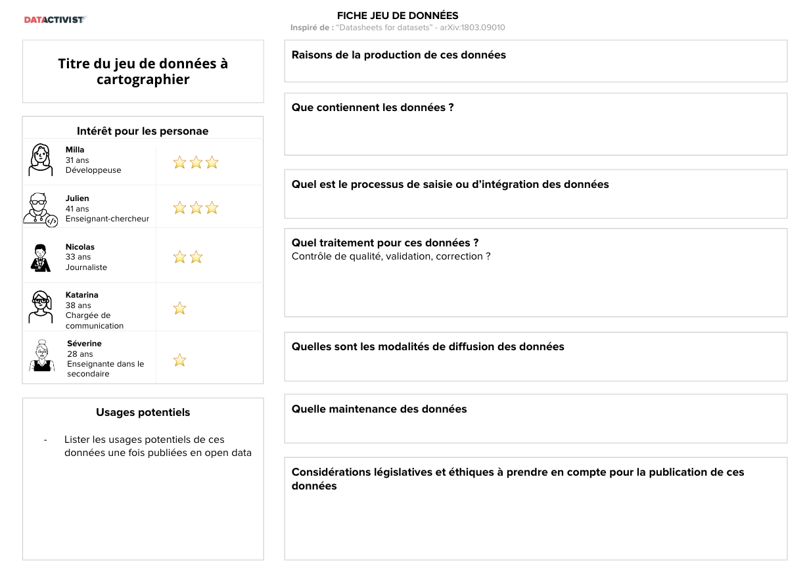
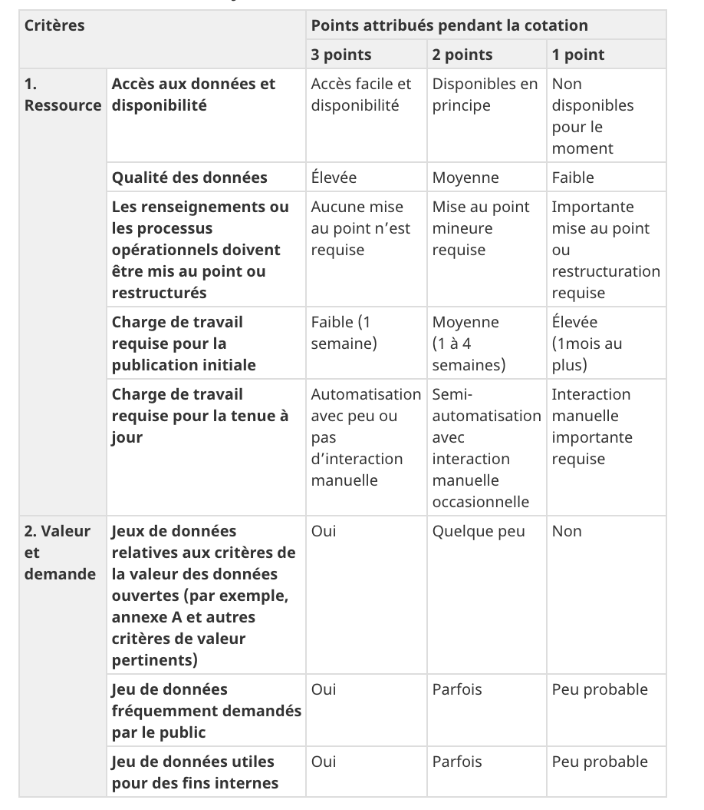
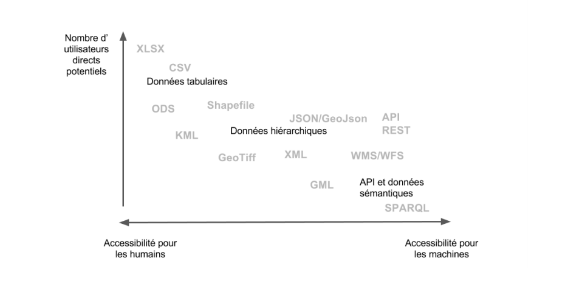
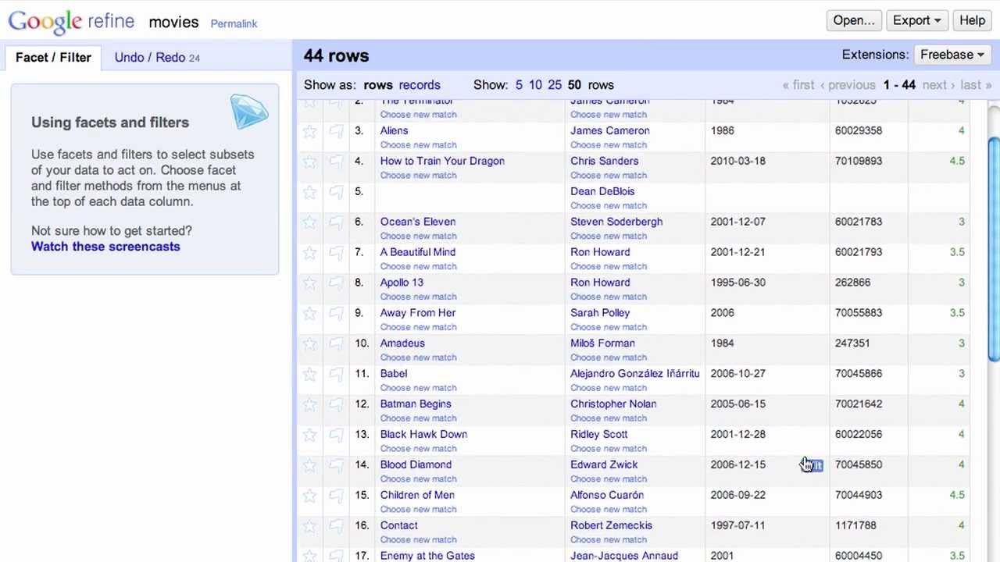
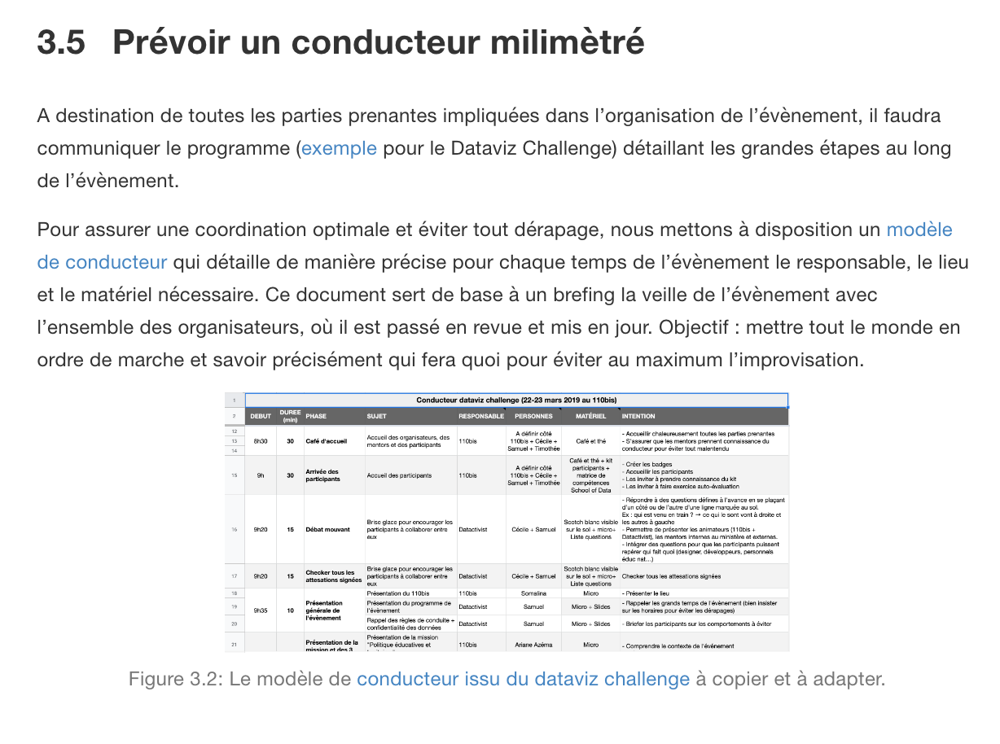

```{r, echo=FALSE}
library(metathis)
meta() %>% 
  meta_description(params$event) %>% 
  meta_name("github-repo" = paste0("datactivist/", params$slug)) %>% 
  meta_viewport() %>% 
  meta_social(
    title = params$title,
    url = paste0("https://datactivist.coop/", params$slug),
    image = params$image,
    image_alt = params$image_alt,
    og_type = "website",
    og_author = "Datactivist",
    og_locale = "fr_FR",
    og_site_name = "Datactivist",
    twitter_card_type = "summary",
    twitter_creator = "@datactivi_st")

```

layout: true

<style>
.remark-slide-number {
  position: inherit;
}

.remark-slide-number .progress-bar-container {
  position: absolute;
  bottom: 0;
  height: 4px;
  display: block;
  left: 0;
  right: 0;
}

.remark-slide-number .progress-bar {
  height: 100%;
  background-color: #e95459;
}

</style>


`r paste0("<div class='my-footer'><span>", params$event, "</span> <center><div class=logo><a href='https://datactivist.coop/'></a></div></center></span></div>")` 

---

class: center, middle

Ces slides en ligne : `r paste0("http://datactivist.coop/", params$slug)`

Sources : `r paste0("https://github.com/datactivist/", params$slug)`


Les productions de Datactivist sont librement réutilisables selon les termes de la licence [Creative Commons 4.0 BY-SA](https://creativecommons.org/licenses/by-sa/4.0/legalcode.fr).

<BR>
<BR>


---
class: middle, center

TVT Innovation vous propose deux ateliers virtuels pour favoriser et accélérer l’engagement initié par votre structure concernant l’ouverture des données. Ces deux ateliers ont pour objectif de vous sensibiliser vous, fournisseurs de data, à l'ouverture de vos données, lever vos potentielles réticences et vous accompagner dans l'ouverture de celles-ci. 
 


**Un projet soutenu par la Région Sud dans le cadre de l'appel à projet "Données ouvertes et intelligentes".** 

---

### Au programme

.pull-left[
#### 1er atelier : OPEN DATA, ON S'INSPIRE ! 
* Rappel des principes, contexte et cadre juridique de l'open data

* Les bénéfices de l'ouverture des données pour les territoires (étude de cas)

* Les facteurs clés de succès d'un projet d'open data 
]

.pull-right[
#### 2nd atelier : OPEN DATA, ON SE LANCE ! 
* Sélectionner les données

* Préparer les données

* Diffuser et valoriser les données

]

---

### Comment ouvrir ses données ?

.pull-left[

.reduite[]
]

.pull-right[
** En résumé :**

* **Étape 1** : Sélectionner les données

* **Étape 2** : Préparer les données

* **Étape 3** : Diffuser et valoriser les données
]
---

class: inverse, center, middle

# Etape 1 : Sélectionner les données


---

### Étape 1 : .red[Sélectionner les données]

* Effectuer un état des lieux permettant de faire .red[**l’inventaire des données existantes.**] 
Cette opération permet également d'identifier d’éventuelles contraintes à l'ouverture et ainsi d'envisager les actions concrètes à mener.

* Enclencher la démarche en priorisant l’ouverture de certains jeux de données. 
.red[**Préférez les données demandées ou attendues par les réutilisateurs ou par des communautés**]

* .red[**Comment savoir quelles données sont prioritaires ?**] Consultez les potentiels usagers des données : acteurs internes, associations du territoires, entreprises. Demandez sur Twitter ou LinkedIn ? Réunissez les ?
---

### Exemple d'une .red[cartographie de données]

> Une cartographie de données a pour objectif de recenser les données issues d'un ou de plusieurs système d’information  afin d'améliorer la connaissance d'un patrimoine de données potentiel.


.center[]

---

### .red[Prioriser la publication de données] après une cartographie

.left-column[Pour les premiers jeux de données, choisissez ceux qui ont la plus forte valeur et qui sont les plus disponibles. 

Source : [Trousse d’outils maison de données ouvertes du Canada](https://ouvert.canada.ca/fr/toolkit/diy/5-mettre-oeuvre-projet-pilote)
]


.reduite.center[


]

---
#### S'appuyer sur le recensement des données .red[des départements]

En 2019, Datactivist et les étudiants de la [licence pro MIND](http://web-filieres.iut.u-bordeaux-montaigne.fr/lpmind/) de l'IUT de Bordeaux ont conduit un recensement des données ouvertes par 10 départements. 

<iframe class="airtable-embed" src="https://airtable.com/embed/shr2IV29hiRCyh32o?backgroundColor=cyan" frameborder="0" onmousewheel="" width="100%" height="463" style="background: transparent; border: 1px solid #ccc;"></iframe>

---
#### S'appuyer sur le recensement des données .red[des communes]

En 2017, Datactivist a conduit un recensement des données de 16 communes. 

<iframe width="100%" height="530px" src="https://docs.google.com/spreadsheets/d/e/2PACX-1vSCQsSGpK2Lx58VvrnIQ7QsOQvozrFHnUVneg-AQcdWWp2Z0XzHqDZO4EhgjxlwTT9aIZTeVYh2PkRX/pubhtml?gid=0&amp;single=true&amp;widget=true&amp;headers=false"></iframe>

---
class: inverse, center, middle

# Etape 2 : Préparer les données

---
### Choisir le format de mise à disposition : .red[les formats ouverts]

Les données doivent être téléchargeables dans un « standard ouvert », c'est à dire dans un format ouvert aisément réutilisable et exploitable par un système de traitement automatisé et pérenne. Les formats ouverts favorisent l’intéropérabilité : les données pourront être réutilisées indépendamment du logiciel qui a été utilisé pour les créer.

Voici quelques exemples de formats « ouverts » conseillés pour la diffusion des jeux de données en ligne : 

* **Texte brut** : ASCII (.txt) / sans extension
* **Texte formaté** : TeX (.tex), OpenDocument Text (.odt), Hypertext Markup
Language (.htm ou .html), XHTML (.xhtml), Feuilles de style en cascade (.css)
* **Données brutes** : CSV (.csv) / sans extension, JSON (.json), XML (.xml)
* **Données géographiques** : KML (.kml), SHP (.shp)

---

### L'importance de la .red[qualité des données]

#### .red[Une remarque récurrente :]

> **Les données publiques sont souvent incomplètes, non actualisées, de mauvaise qualité et fragmentaires.** 

> Dans la plupart des cas, les catalogues ou portails de données ouvertes sont alimentés manuellement, conséquence d’une approche informelle de la gestion des données. 

> De plus, les procédures, les calendriers et les responsabilités des institutions publiques chargées de leur gestion manquent souvent de clarté. Ainsi, de manière générale, la gestion et la publication des données ouvertes sont fragiles et sujettes à des erreurs multiples.

.footnote[Source : 
[Rapport mondial du 4e Open Data Barometer](https://opendatabarometer.org/4thedition/report/?lang=fr)
]

---

### Veiller à la .red[qualité des données]

Quelques principes à retenir :

* Mettre à disposition des séries chronologiques les plus longues possibles avec la granularité la plus fine, tout en respectant le secret de la vie privée et le secret statistique ; 
* Compléter vos fichiers par les données de géolocalisation quand cela est possible ;
* Compléter l'adresse postale par le code INSEE (afin de faciliter la géolocalisation dans le cas des noms de villes homonymes) ;
* Utiliser la norme ISO 8601 pour les dates, format : « AAAA-MM-JJ ».

#### Choisir la licence de réutilisation

Le contrat de licence de réutilisation permet de déterminer les droits et obligations réciproques des parties. Il est important que toutes les réutilisations, y compris celles consenties à titre gratuit, soient conditionnées à l'acceptation d'un contrat, et que l'usager en soit clairement informé. La loi pour une République Numérique prévoit deux licences possibles : la Licence Ouverte ou ODBL

---

### .red[Datasheet for Datasets] : un trame pour la documentation des données


.pull-left[

[](https://teamopendata.org/t/traduction-et-adaptation-du-modele-de-description-des-donnees-datasheet-for-datasets/1400)

]

.pull-right[
* Motivations pour la création du jeu de données

* Composition du jeu de données

* Processus de collecte des données

* Pré-traitement des données

* Diffusion du jeu de données

* Maintenance du jeu de données

* Considérations légales et éthiques


]


---

### Accessibilité des formats des données .red[pour les humains et pour les machines]


.center[]

.footnote[ Source : Françoise Paquienséguy, Valentyna Dymytrova. Livrable 1.2 Analyse de portails métropolitains de données ouvertes à l’échelle internationale. Rapport de recherche 1.2, Equipe d’accueil lyonnaise en Sciences de l’information et de la communication. 2017. ffhal-01449348f ] 

---

### [WTFCSV](https://databasic.io/en/wtfcsv/) : un outil pour prévisualiser un jeu de données en .csv


---
### OpenRefine : .red[pour éditer ou traiter] des données en masse

> **OpenRefine est un outil gratuit de traitement de données en masse**
> Il se télécharge sur l'ordinateur et permet de faire des opérations de traitement de données sur de gros fichiers, qu'Excel ne peut pas traiter. 




---

class: inverse, center, middle

# Étape 3 : Diffuser et valoriser les données

---

### La découvrabilité : un .red[enjeu crucial]
.pull-left[

]
.pull-right[
"La découvrabilité des données est un défi majeur. Nous avons des portails et des registres de données, mais les organismes gouvernementaux qui relèvent d'un seul gouvernement national publient toujours les données de différentes façons et à différents endroits (...).

**La découvrabilité des données est une condition préalable pour que les données ouvertes réalisent leur potentiel. Or, actuellement la plupart des données sont très difficiles à trouver**."]


.footnote[Source : [Classement mondial de l'Open Data](https://index.okfn.org/insights/)]


---

### Rendre les données trouvables 

#### 1 - Les plateformes d'open data

Elles permettent de faire en sorte que les données soient faciles à trouver auprès des utilisateurs grâce à une recherche optimisée par filtres ou par texte libre **dans un catalogue**. Elles offrent aussi des flux de données découvrables et archivables qui permettent à des moteurs de recherche d’indexer les données ouvertes et de les rendre plus facile à trouver.

> Important : le flux d'actualité d'un portail open data contient l'ajout de nouveaux jeux de données mais également la liste des mises à jour qui peuvent avoir des conséquences sur les applications qui les utilisent. Il est donc essentiel qu'un tel flux soit disponible pour les utilisateurs souhaitant être tenus informés.

---

### Rendre les données trouvables 

#### 2 - Soigner ses métadonnées

> “Les métadonnées sont de l’information structurée qui décrit, explique, localise ou facilite autrement l’obtention, l’utilisation ou la gestion d’une ressource d’information. Les métadonnées sont souvent appelées données des données ou information sur l’information.”

Source : National Information Standards Organization
http://www.niso.org/publications/press/UnderstandingMetadata.pdf

> **Les Métadonnées descriptives décrivent une ressource à des fins de découverte et d’identification.**

---

### En pratique : où diffuser vos données ?

#### 1 - Sur .red[le portail de votre collectivité]

Quand elle en dispose déjà d'un, prenez contact avec l'équipe data qui pilote le portail.

#### 2 - Sur .red[datasud.fr]

Le portail est ouvert à toutes les collectivités de la région, prendre contact avec le service Smart Data de la région Sud. 

#### 3 - Sur .red[data.gouv.fr]

N'importe quel acteur public ou privé peut y publier des données, y compris des personnes physiques. Pour que ses données soient considérées comme "service public certifié", il faut réclamer le compte de son organisation ou y avoir accès. 
** Les données publiées sur datasud.fr et sur la plupart des portails open data locaux sont moissonnées par data.gouv.fr.**

---

### Encourager les .red[réutilisations internes]

* **Sensibiliser**, faire connaître et démontrer l’intérêt de l’ouverture des données auprès des décideurs et des agents.

* **Inciter les services producteurs à ouvrir** les données qu’ils produisent et à utiliser les données ouvertes pour leurs propres usages.

* **Diffuser une culture de la donnée** au sein de l’organisation afin d’accompagner le développement des usages et favoriser la transformation de l’action publique (pilotage, évaluation, etc.) à partir des données.

* Favoriser les **échanges entre pairs** pour partager des retours d’expérience et des bonnes pratiques.

* **Animer et acculturer les communautés d’utilisateurs** internes afin de renforcer leur capacité à (ré)utiliser les données pour leurs propres besoins.

---

### Susciter les .red[usages externes]
.pull-left[
* **Editorialiser les données brutes** en proposant des représentations visuelles facilitant leur lecture (graphiques, cartographies, etc.)

* **Communiquer pour promouvoir et faire connaître les données ouvertes** auprès des communautés des utilisateurs et réutilisateurs potentiels lors d'événéments (rencontre, hackathon, concours, appel à projets, etc.).
]

.pull-right[


Datactivist a produit un [guide complet pour l'organisation d'un sprint data](https://datactivist.coop/datavizchallenge/guide/docs/principes.html)

.reduite.center[]
]


---
class: inverse, center, middle

# Merci !


