```{r, echo=FALSE}
library(metathis)
meta() %>% 
  meta_description(params$event) %>% 
  meta_name("github-repo" = paste0("datactivist/", params$slug)) %>% 
  meta_viewport() %>% 
  meta_social(
    title = params$title,
    url = paste0("https://datactivist.coop/", params$slug),
    image = params$image,
    image_alt = params$image_alt,
    og_type = "website",
    og_author = "Datactivist",
    og_locale = "fr_FR",
    og_site_name = "Datactivist",
    twitter_card_type = "summary",
    twitter_creator = "@datactivi_st")

```

layout: true

<style>
.remark-slide-number {
  position: inherit;
}

.remark-slide-number .progress-bar-container {
  position: absolute;
  bottom: 0;
  height: 4px;
  display: block;
  left: 0;
  right: 0;
}

.remark-slide-number .progress-bar {
  height: 100%;
  background-color: #e95459;
}

</style>


`r paste0("<div class='my-footer'><span>", params$event, "</span> <center><div class=logo><a href='https://datactivist.coop/'></a></div></center></span></div>")` 


---

class: center, middle

Ces slides en ligne : `r paste0("http://datactivist.coop/", params$slug)`

Sources : `r paste0("https://github.com/datactivist/", params$slug)`


Les productions de Datactivist sont librement réutilisables selon les termes de la licence [Creative Commons 4.0 BY-SA](https://creativecommons.org/licenses/by-sa/4.0/legalcode.fr).

<BR>
<BR>


---
class: middle, center

TVT Innovation vous propose deux ateliers virtuels pour favoriser et accélérer l’engagement initié par votre structure concernant l’ouverture des données. Ces deux ateliers ont pour objectif de vous sensibiliser vous, fournisseurs de data, à l'ouverture de vos données, lever vos potentielles réticences et vous accompagner dans l'ouverture de celles-ci. 
 


**Un projet soutenu par la Région Sud dans le cadre de l'appel à projet "Données ouvertes et intelligentes".** 

---
### Au programme

.pull-left[
#### 1er atelier : OPEN DATA, ON S'INSPIRE ! 
* Rappel des principes, contexte et cadre juridique de l'open data

* Les bénéfices de l'ouverture des données pour les territoires (étude de cas)

* Les facteurs clés de succès d'un projet d'open data 
]

.pull-right[
#### 2nd atelier : OPEN DATA, ON SE LANCE ! 
* Sélectionner les données

* Préparer les données

* Diffuser et valoriser les données

]

---
class: inverse, center, middle

### Ces dix choses incroyables qui n'auraient pas existé sans l'open data

---
class: inverse, center, middle

# 1. Yuka

.center[]

---


---
## Yuka 

### 8,5 millions d'utilisateurs
### 2 millions de produits scannés chaque jour
### Top 10 des applis gratuites sur l'Appstore et le Playstore

---

[.center[]](https://fr.openfoodfacts.org/decouvrir)


---
class: inverse, center, middle

# 2. Pokemon go 

.center[]

---

[.center[]](https://teamopendata.org/t/pokemon-go-migre-sur-openstreetmap/113)


---


## Google Maps


---
## OpenStreetMap


---
## OpenStreetMap


---
class: inverse, center, middle

# 3. Une carte de la pollution de l'air dans les écoles

---

## Merci AirParif !

[](https://carte-des-ecoles.de-l-air-pour-nos-enfants.fr/)

---

[](https://www.data.gouv.fr/fr/datasets/base-de-donnees-de-la-pollution-aerienne-aux-abords-des-ecoles-et-creches-dile-de-france/)

---
class: inverse, center, middle

# 4. Les applis de mobilité

---
## Les applis de mobilité


.center[.reduite[]]

---
## Les applis de mobilité

.center[.reduite[]]

---
## Les applis de mobilité

.center[.reduite[]]


---
## Les applis de mobilité

.center[.reduite[]]

---
class: inverse, center, middle


# 5. Les prix de l'immobilier 

---

[.center[]](https://www.meilleursagents.com/prix-immobilier/dvf/)

---
## Une réutilisation rendue possible par l'ouverture de données publiques

[.center[]](https://www.data.gouv.fr/fr/reuses/explorateur-de-biens-vendus/)

---
class: inverse, center, middle

# 6. Un référentiel ouvert et partagé d'adressage

---

[](https://adresse.data.gouv.fr/)

---
class: inverse, center, middle

# 7. Mapillary

---
## Mapillary

[](https://www.mapillary.com/map/im/AB9hac4KYucSZOaWQyunvw)

http://www.villes-internet.net/actions/5bbf52afbb3eab784351e5c5

---
## Mapillary

[](https://www.mapillary.com/map/im/AB9hac4KYucSZOaWQyunvw)

---
## 8. Les tests Covid

.pull-left[
Le **5 janvier 2020**, 5 jours après l'annonce par la Chine d'un nouveau virus, les données du génome du SARS COV-2 ont été publiées dans la base internationale de données génétiques, GenBank.

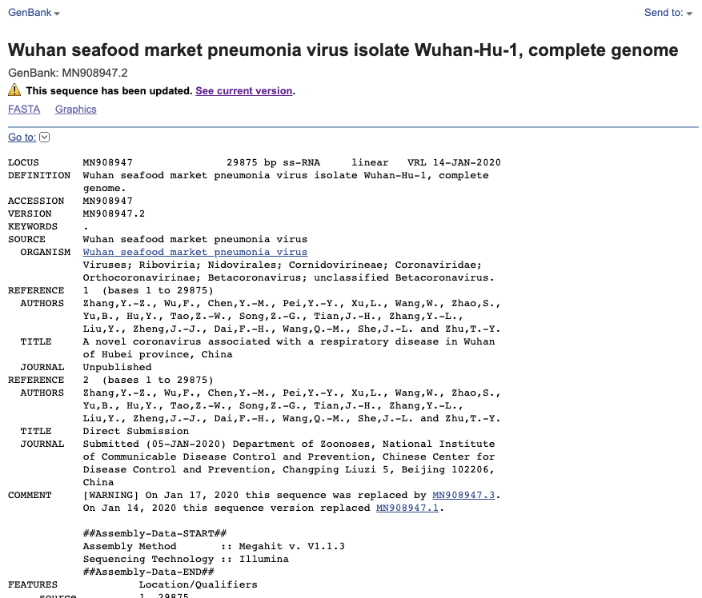
]

.pull-right[
Le **15 janvier 2020**, 10 jours plus tard, sur la base de ces données, une équipe de recherches allemande crée le premier test PCR de dépistage de la Covid-19. 

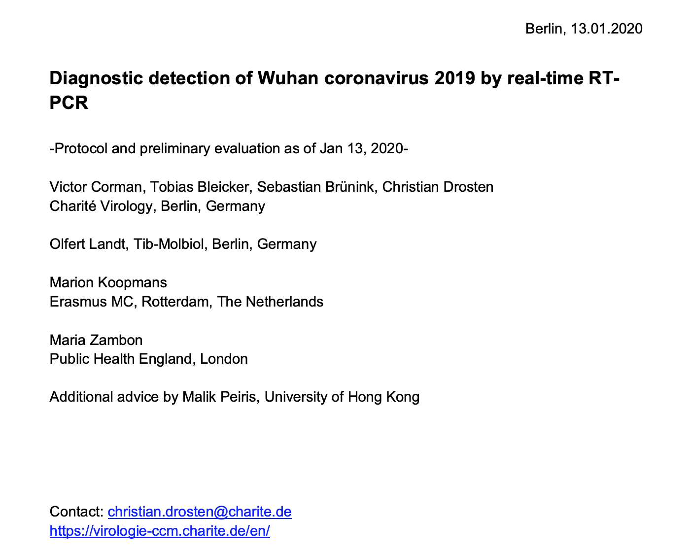

]

.footnote[Source : Wikipedia, [chronologie de la pandémie de Covid-19](https://en.wikipedia.org/wiki/Timeline_of_the_COVID-19_pandemic_in_January_2020)]

---
## 9. Les tableaux de bord de la Covid

.center.reduite[
[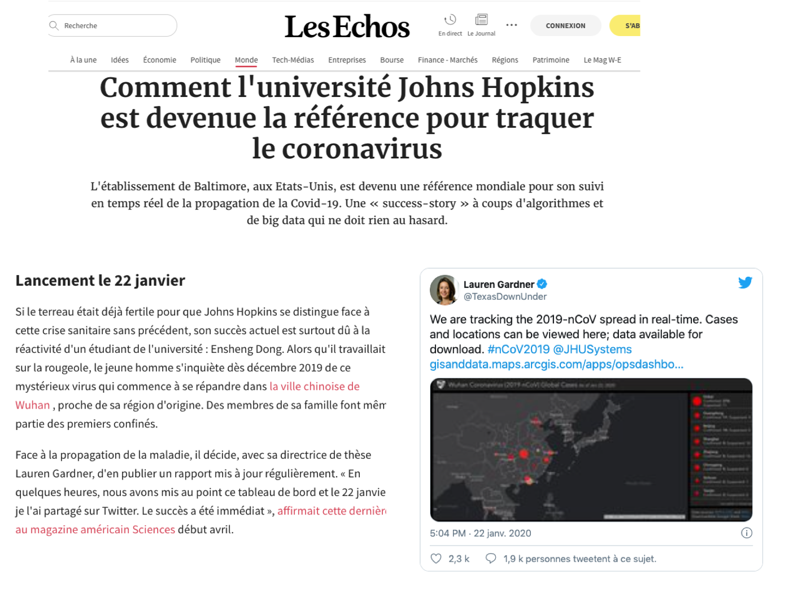](https://www.lesechos.fr/monde/etats-unis/comment-luniversite-johns-hopkins-est-devenue-la-reference-pour-traquer-le-coronavirus-1224856)
]

---
## 9. Les tableaux de bord de la Covid

.reduite.center[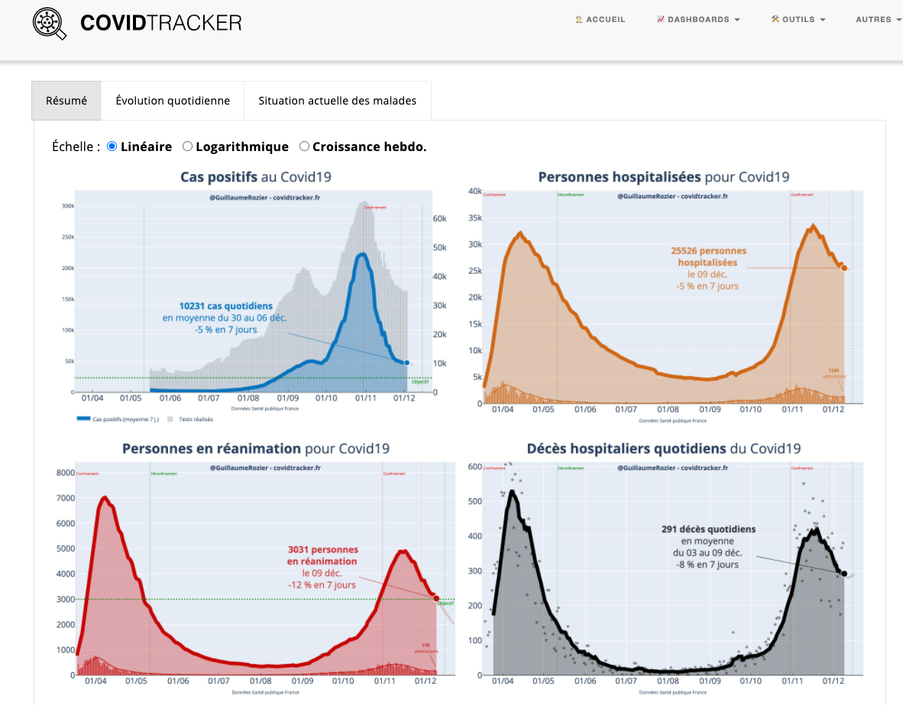](https://covidtracker.fr/covidtracker-france/)

---
class: inverse, center, middle


# 10. Et pour finir... des plantes !

---
## 10. Plantnet

.reduite.center[
[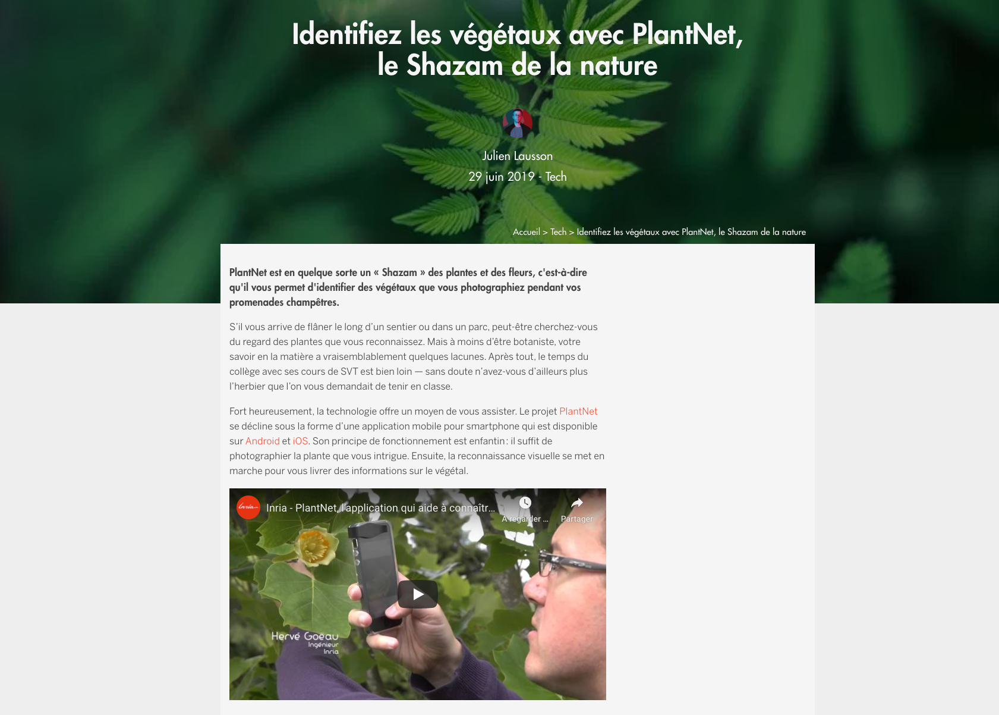](https://www.numerama.com/tech/281269-lapplication-plantnet-le-shazam-des-plantes-et-des-fleurs.html)
]

---
## 10. Plantnet
.reduite.center[
[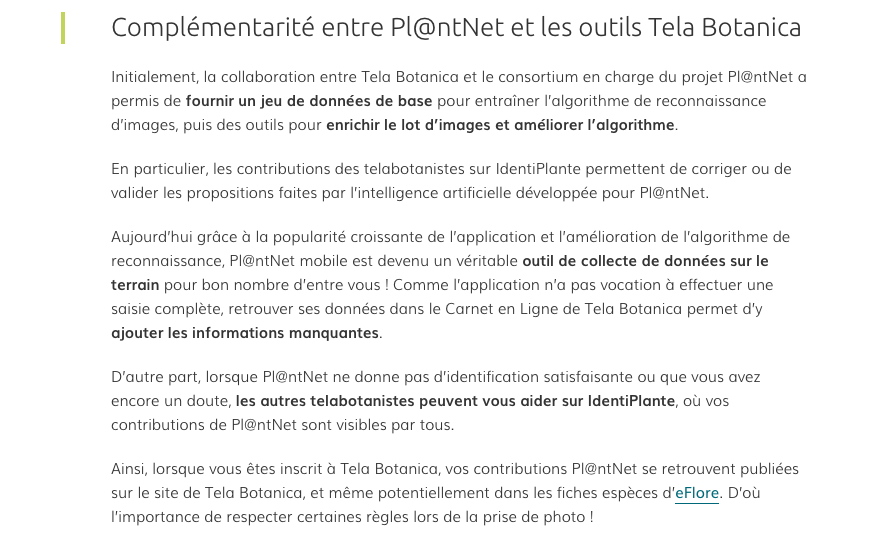](https://www.tela-botanica.org/2018/10/plantnet-mobile-sur-votre-ordinateur/)
]


---
class: inverse, center, middle


# Rappel des principes, contexte et cadre juridique de l'open data

---
class: inverse, center, middle

# Les bénéfices de l'ouverture des données pour les territoires (étude de cas)


---
### [.red[L'open data : ]](https://books.openedition.org/cdf/5005?lang=fr) une notion aux multiples facettes

.reduite.center[]

---
### Des principes techniques qui se sont imposés


.reduite[]

---
### Et stabilisés dans la [charte internationale de l'open data](https://opendatacharter.net/)
.reduite[.center[

]]

---

### Le guide CADA-CNIL : le document de référence

Je n'indique ici que quelques éléments généraux sur le cadre juridique, ce guide constitue votre source de référence. Joël Gombin, co-fondateur de Datactivist, a publié sa [fiche de lecture](https://teamopendata.org/t/guide-commun-cnil-et-cada-open-data-rgpd/1320) sur TeamOpenData.

.reduite[.center[
[](https://www.cnil.fr/sites/default/files/atoms/files/guide_open_data.pdf)
]]

---

### 1978 : La loi CADA, vers le "droit de savoir"

* Le fondement : la .red[Déclaration des Droits de l'Homme et du Citoyen de 1789] dans son article 15, "la Société a le droit de demander compte à tout Agent public de son administration." 

* Le droit d'accès des citoyens à l'information publique émerge en **1978 avec la loi dite CADA** du nom de la Commission d'Accès aux Documents Administratifs. 

* La France était le .red[3e pays au monde] après la Suède en 1766 et les Etats-Unis en 1966 avec le Freedom of Information Act (FOIA) en 1966  à accorder un "droit de savoir" avec pour but d'améliorer les relations entre le public et l'administration.

.footnote[Il faudrait maintenant désigner la loi comme le Code des relations entre le public et l'administration (CRPA) qui, dans son [livre 3](https://www.legifrance.gouv.fr/affichCode.do;jsessionid=BDF8EC0BD562E214CCD9A5ADD435D690.tplgfr42s_1?idSectionTA=LEGISCTA000031367685&cidTexte=LEGITEXT000031366350&dateTexte=20190429), codifie le droit d'accès et de réutilisation mais il est encore moins connu que la loi CADA…]


---
### Les conditions d'exercice du droit d'accès

.red[ Une définition très large des documents administratifs]
> Les documents administratifs peuvent revêtir de nombreuses formes (dossiers, rapports, études, comptes rendus, procès-verbaux, statistiques, directives, instructions, circulaires, codes sources, etc.) et adopter tout support (écrit, enregistrement sonore ou visuel, forme numérique ou informatique). 

Le droit d'accès s'appplique aux documents administratifs produits dans le cadre d'une .red[mission de service public] ie :
> Une mission d'intérêt général sous le contrôle de l'administration et qui est dotée à cette fin de prérogatives de puissance publique est chargée de l'exécution d'un service public. 

Il ne s’exerce que si l’administration a effectivement en sa possession le document demandé, que si le document est formellement **achevé**, qu'il existe et qu'il n'est pas **préparatoire à une décision administrative** en cours. 

---
### Les exclusions au droit d'accès

Le droit d'accès .red[**ne doit pas porter atteinte aux secrets protégés**] : 
- le fonctionnement de l'État : délibérations du Gouvernement, secret de la défense nationale, la conduite de la politique extérieure de la France, la sûreté de l'État…
- la protection de la vie privée
- le secret médical
- le secret des affaires (secret des procédés, des informations économiques et financières et
des stratégies commerciales ou industrielle)
- les mentions portant une appréciation ou un jugement de valeur sur une personne physique ou
faisant apparaître un comportement d'une personne pouvant lui porter préjudice…

Le document ne peut être publié qu'après avoir fait l'objet d'un traitement permettant
d'.red[**occulter les mentions protégées**]. L’administration n’est pas tenue de publier un document lorsque “les travaux d’occultation dénatureraient ou videraient de sens le document” ou si “le document est indivisible ou l’occultation est trop complexe”.
---
### Le cas des données personnelles

La prohibition de la communication à des tiers ne porte pas sur les données personnelles en général, mais .red[**sur les données à caractère personnel relevant de la vie privée**] des personnes concernées (âge, coordonnées personnelles, situation patrimoniale et financière, sympathies politiques, les croyances religieuses…)

La mise en ligne de données à caractère personnel sans anonymisation n'est permise que dans .red[**trois cas**] :
1. une disposition législative contraire le prévoit (exemple : [Transparence Santé](https://www.data.gouv.fr/fr/datasets/transparence-sante-1/))
2. si les personnes intéressées ont donné leur accord (consentement au sens de l’article 4 du RGPD)
3. les documents relevant de [l’article D312-3-1 du CRPA](https://www.legifrance.gouv.fr/affichTexte.do;jsessionid=51E99AF738C12521572D6A7F6C8C03E8.tplgfr23s_1?cidTexte=JORFTEXT000037797147&dateTexte=&oldAction=rechJO&categorieLien=id&idJO=JORFCONT000037796937)


Hors de ces cas, il faut .red[**[anonymiser les données](https://github.com/SGMAP-AGD/anonymisation/wiki/Guide-de-l'anonymisation)**] : elles ne doivent plus se référer à une personne réelle (exit les noms, identifiants…) et ne doivent plus être spécifiques à un individu mais communes à un ensemble de personnes. L’indexation de ces données par un moteur de recherche externe est proscrite.


---
### Du droit d'accès au droit de réutilisation

Alors qu'aux Etats-Unis les données publiques sont placées dans le domaine public depuis les années 70, la question de la réutilisation des données publiques a émergé en France et en Europe dans les années 1990 avec le développement d'Internet facilitant la diffusion des données publiques et le développement de nouveaux services au public. Quelques jalons :

```{r echo=FALSE}
library(timevis)
data <- data.frame(
  id      = 1:7,
  content = c("Loi CADA","Directive PSI", "Directive INSPIRE", "Révision de la directive PSI", "Loi Notre", "Loi Valter", "Loi pour une République Numérique"),
  start   = c("1978-07-17","2003-11-17", "2007-03-14","2013-06-13","2015-08-07","2015-12-28","2016-10-07")
)
timevis(data, loadDependencies = FALSE, width = "715px", height = "350px")
```

---

### Loi pour une République Numérique : l'ouverture des données par défaut


Promulguée le 7 octobre 2016, après 4 ans d'annonces et de consultation, le titre 1 de la [loi pour une République  Numérique](https://www.legifrance.gouv.fr/affichTexte.do;jsessionid=B5632993E54F7CCC2606664B64CDF612.tpdila11v_1?cidTexte=JORFTEXT000033202746&categorieLien=id) porte sur l'ouverture des données publiques. 

La loi impose un principe d'.red[**ouverture des données par principe**] qui ne fait pas l'objet de sanctions à toutes les administrations, les entreprises délégataires d'une mission de service public et les .red[**collectivités locales de plus de 3500 habitants et 50 agents**]. 

L'ouverture concerne un .red[**périmètre très large**] : 
* les documents communiqués suite à des demandes CADA
* les "bases de données"
* les données "dont la publication présente un intérêt économique, social, sanitaire ou environnemental".
Rares sont donc les données publiques qui ne sont pas concernées par cette obligation d'ouverture. 


---
### Loi pour une République numérique : une limitation des licences

La loi **limite par décret les licences** qui peuvent être utilisées par les administrations. Le [décret du 27 avril 2017](https://www.legifrance.gouv.fr/eli/decret/2017/4/27/2017-638/jo/texte) autorise deux licences : 

* la Licence Ouverte d'Etalab 

* la licence ODbL (Open Database License).

Ces deux licences offrent **un choix aux administrations** : la licence ouverte étant plus permissive que la licence ODBL qui a été conçue dans une logique de "pot commun" permettant de garantir que les données resteront ouvertes après leur réutilisation.

Utiliser une autre licence impose une **homologation** auprès de la DINSIC avec un exposé des motifs ayant conduit à sortir de la liste fixée dans le décret et une consultation des usagers affectés par la licence proposée. L'homologation doit être faite pour chaque jeu de données même si la licence reste la même.

---
### Loi pour une République numérique : une limitation des licences

.reduite.center[
[](http://www.opendatalab.fr/index.php/laboratoire/le-kit-collectivites)
]
.footnote[source : [SGAR Occitanie](http://www.opendatalab.fr/index.php/laboratoire/le-kit-collectivites)]


---
### Exemple de données ouvertes : la [base SIRENE](https://www.data.gouv.fr/fr/datasets/base-sirene-des-entreprises-et-de-leurs-etablissements-siren-siret/)

.reduite.center[]

---
### Exemple de données ouvertes : la [base adresse nationale](https://www.data.gouv.fr/fr/datasets/base-adresse-nationale/)
.reduite[.center[]]

---
### Exemple de données ouvertes : les [accidents de la route](https://www.data.gouv.fr/fr/datasets/base-de-donnees-accidents-corporels-de-la-circulation/)
.reduite.center[]
---
### .red[Exemple d'usage] : Les accidents de la route
.reduite.center[]
.footnote[Plus d'accidents sur l'A8 mais surtout plus de véhicules…]

---
### Exemple de données ouvertes : les [inspections des restaurants](https://www.data.gouv.fr/fr/datasets/resultats-des-controles-officiels-sanitaires-dispositif-dinformation-alimconfiance/)
.reduite.center[]
.footnote[[Résultats des contrôles officiels sanitaires : dispositif d'information « Alim’confiance »](https://www.data.gouv.fr/fr/datasets/resultats-des-controles-officiels-sanitaires-dispositif-dinformation-alimconfiance/)]
---
### .red[Exemple d'usage] : les inspections des restaurants
.reduite[.center[]]
.footnote[[155 établissements dont l'hygiène doit être corrigée de manière urgente ](https://dgal.opendatasoft.com/explore/dataset/export_alimconfiance/table/?disjunctive.filtre&disjunctive.app_libelle_activite_etablissement&disjunctive.ods_type_activite&refine.synthese_eval_sanit=A+corriger+de+mani%C3%A8re+urgente)]
---
### Exemple de données ouvertes : le [répertoire national des élus](https://www.data.gouv.fr/fr/datasets/donnees-du-repertoire-national-des-elus/)

.reduite.center[

]

---
### Exemple de données ouvertes : les [valeurs foncières](https://www.data.gouv.fr/fr/datasets/demandes-de-valeurs-foncieres/#_)


---
### .red[Exemple d'usage : ]Les valeurs foncières

.reduite.center[
[](https://www.meilleursagents.com/prix-immobilier/dvf/aix-en-provence-13100/avenue-saint-jerome-1108044769/)
]

---
class: inverse, center, middle

# Les bénéfices de l'ouverture des données


---
### Valoriser le travail d’une administration ou d’une entreprise

Le département de la Gironde a produit un travail de visualisation et d'explication du budget en 2019 à partir de ses données ouvertes ([source](https://www.gironde.fr/un-budget-au-service-des-solidarites-humaine-et-territoriale)). 

.reduite.center[
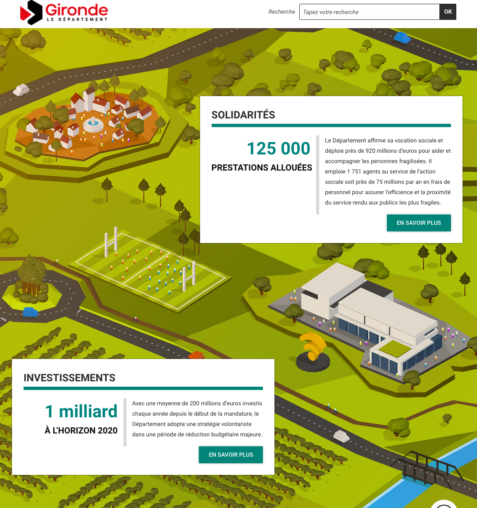
]

---
### Valoriser le travail d’une administration ou d’une entreprise

Le département de la Gironde a produit un travail de visualisation et d'explication du budget en 2019 à partir de ses données ouvertes ([source](https://www.gironde.fr/un-budget-au-service-des-solidarites-humaine-et-territoriale)). 

.pull-left[
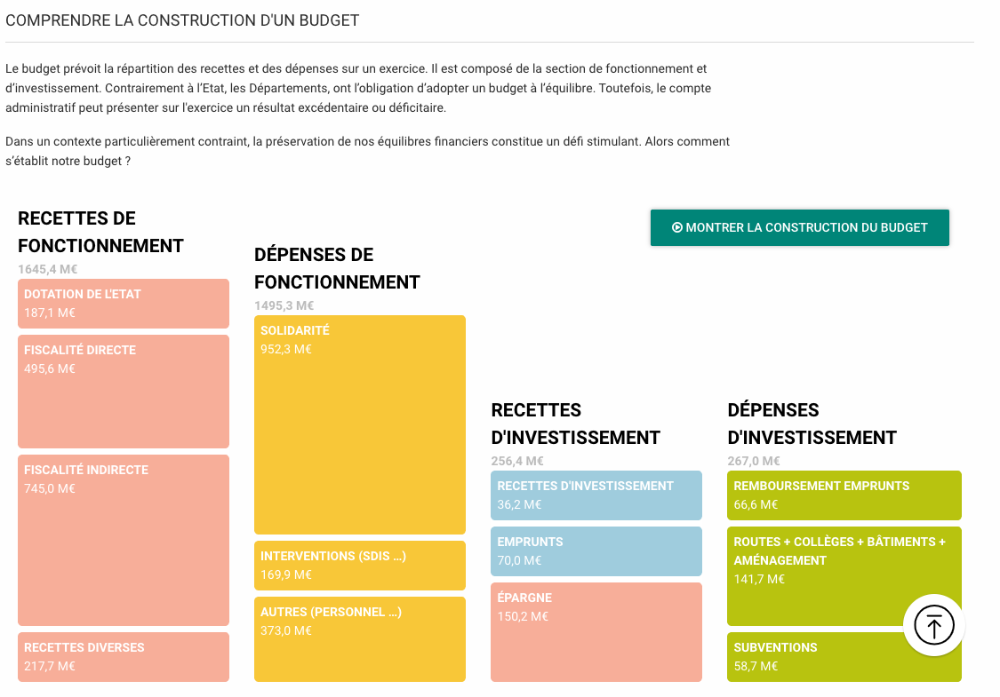
]

.pull-right[
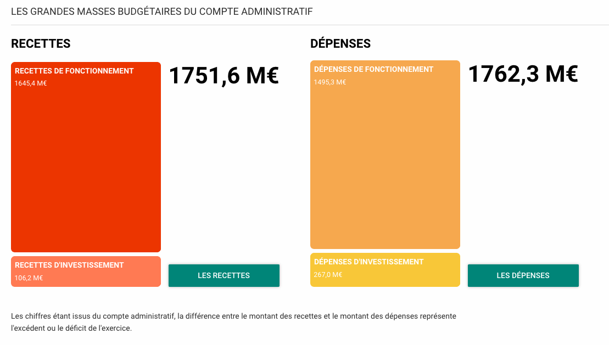
]

---
### Renforcer les principes du service public


#### Continuité : des données accessibles en permanence et mises à jour


#### Adaptabilité : des données adaptées à la demande (formats, nature, services)


#### Egalité : des données accessibles à tous, sans restriction ni discrimination			
				
			

---
### Faire gagner du temps aux différents services

Répondre moins souvent aux demandes individuelles du fait de la publicité des données	: 

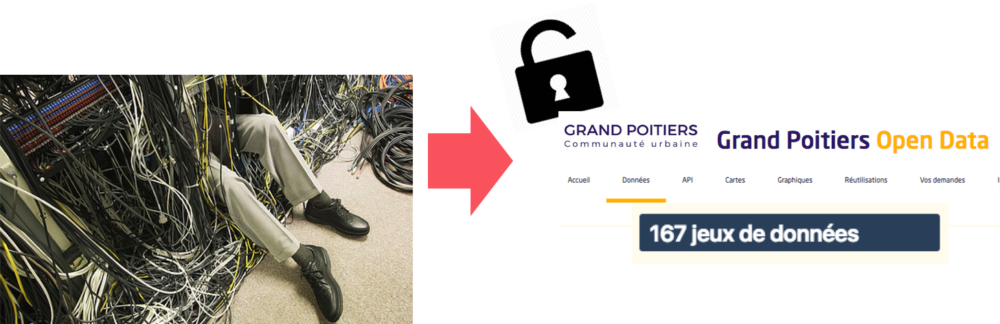

---
### Ouvrir les possibilités de croisements de données

Exemple des vélos en libre service à New York : confronter modèles et usages


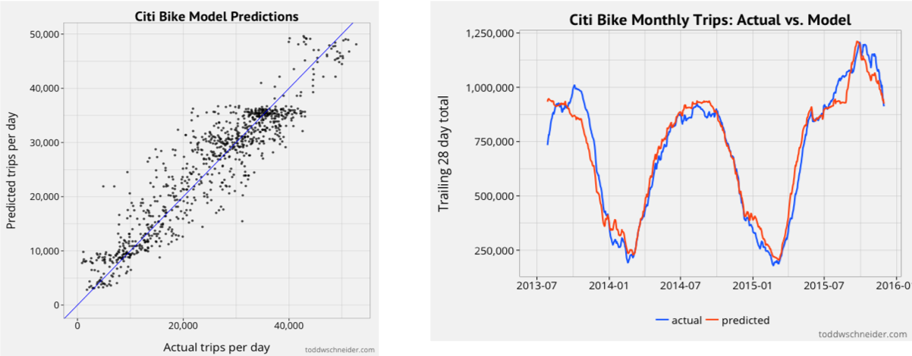

---
### Questionner des politiques publiques

Exemple des dataviz sur les vélos en libre service				

[](https://bikesharemap.com/)

---
### Améliorer la qualité des données

.pull-left[

#### En donnant de la visibilité aux données

#### + d’audience 

#### = + de corrections
			
]


.pull-right[

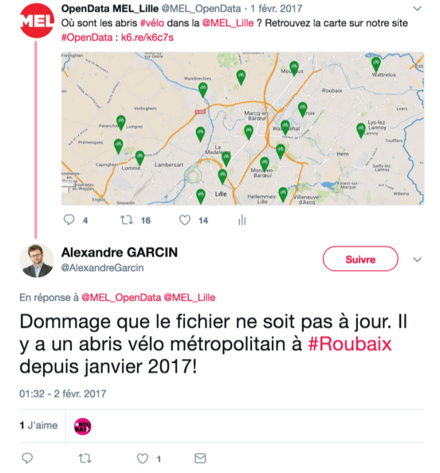
]

---
### Améliorer la qualité des données

Grâce à la comparaison de données ouvertes : exemple à Poitiers

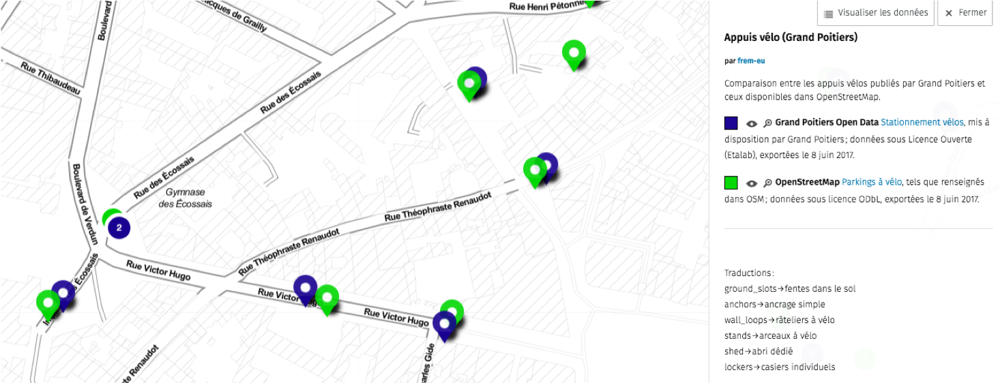
---

### Révéler des enjeux de souveraineté  sur les données et des SI 

.pull-left[
* Connaître les données dont on est propriétaire

* Savoir qui est légitime pour les mettre à jour

* Connaître les données qu’on ne possède pas

* Créer des liens (API) avec les partenaires, délégataires, prestataires

* Négocier des accès aux données (échanges)

]

.pull-right[
.reduite[]
]

---
### Pour la transparence de l’action publique 

La transparence : pilier pour la démocratie

.reduite.center[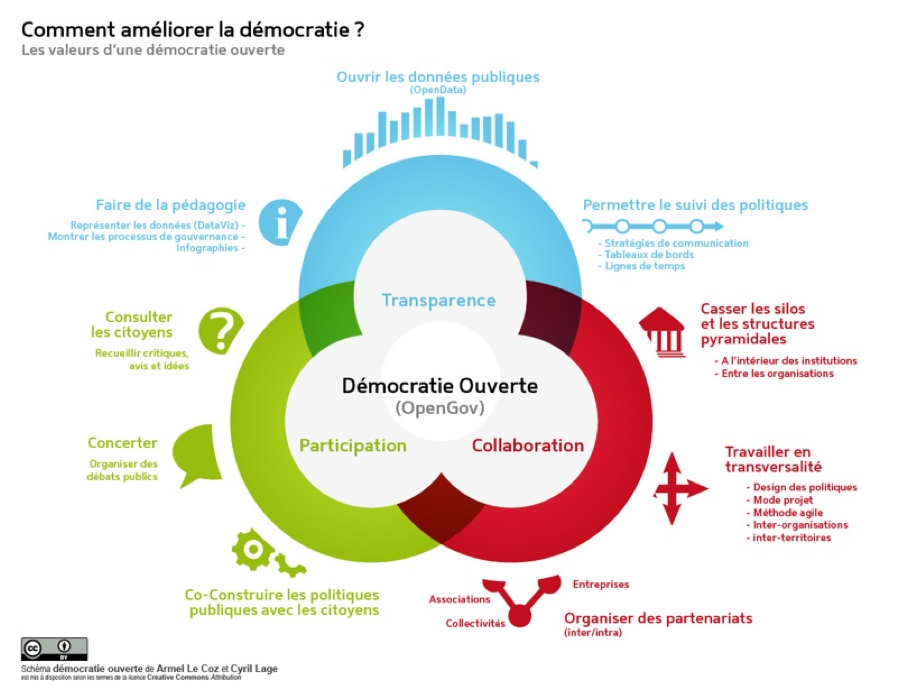]


---
### Pour la transparence de l’action publique

Une action publique plus claire. Exemple à Issy Les Moulineaux : 

[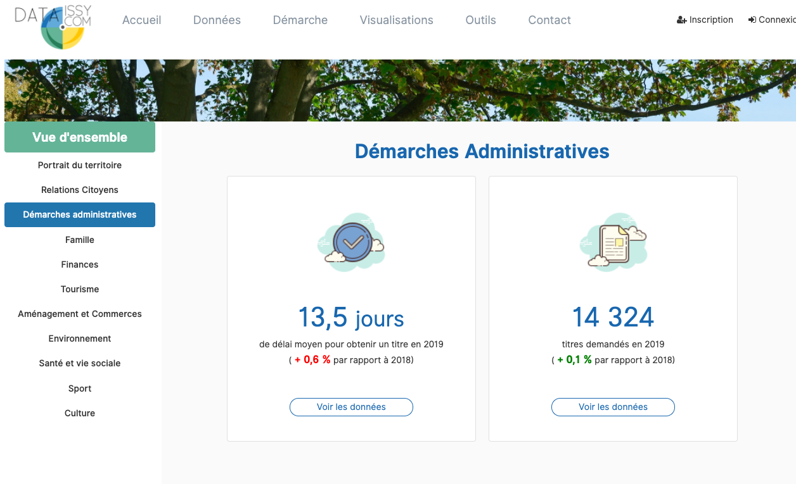](https://data.issy.com/pages/tableaux-de-bord-issy/)

---
### Pour impliquer davantage les citoyens dans la production des données

Exemple de CartoQuartiers à Nantes

[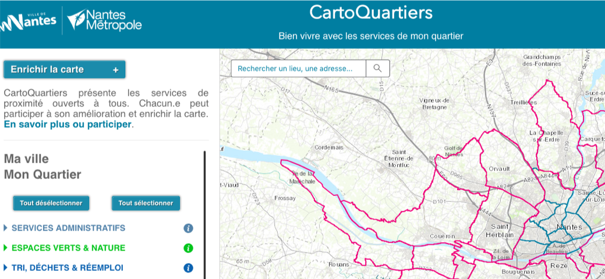](https://www.cartoquartiers.fr/)

---
### Pour être plus forts ensemble, et plus souverains sur nos données

[MapCompare](https://tools.geofabrik.de/mc/#17/43.5032/5.3828&num=4&mt0=mapnik&mt1=google-map&mt2=mapnik-german&mt3=here-map) : comparer OSM, Google Maps et Here Maps

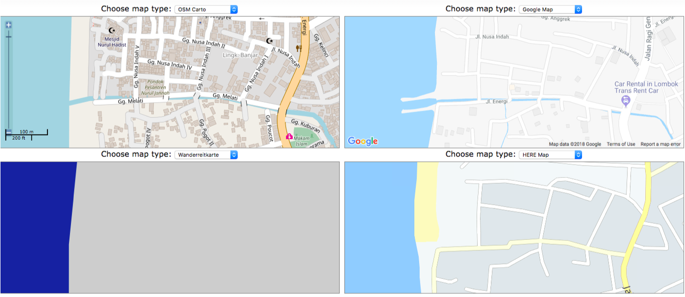

---
### Pour être plus forts ensemble, et plus souverains sur nos données


---
### Pour la data science et les savoirs ouverts

Exemple autour de la base de données sur les accidents de la route
				
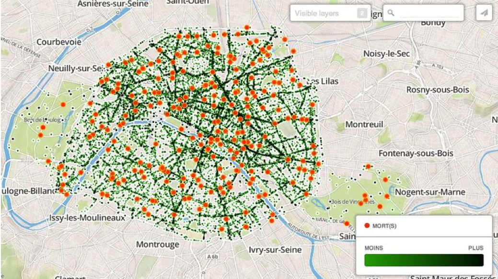		
---
### Pour la data science et les savoirs ouverts  		

Exemple autour de la base de données sur les accidents de la route

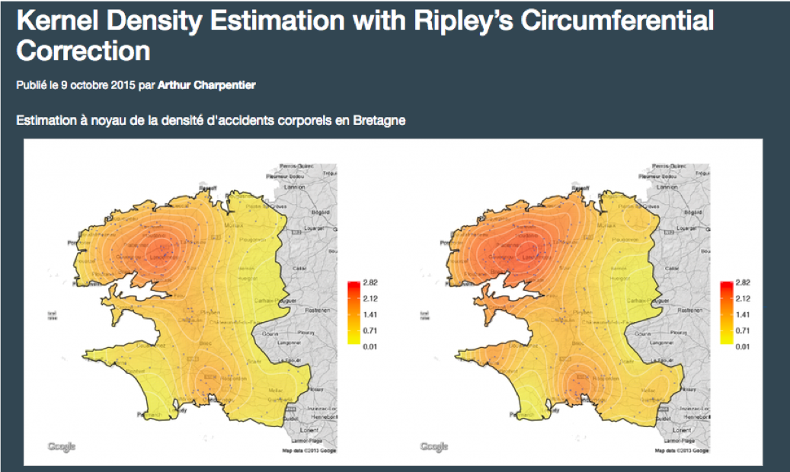

---
### Pour le data journalisme

[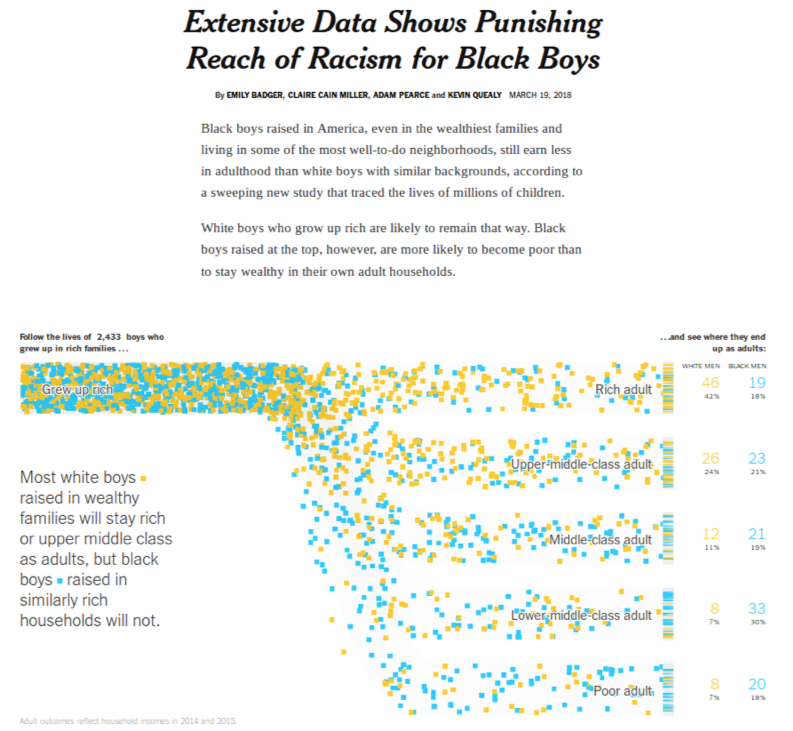](https://www.nytimes.com/interactive/2018/03/19/upshot/race-class-white-and-black-men.html)

---
### Pour permettre le développement de  nouveaux services

#### …mais garder en tête que l’open data est un investissement de long terme 

.reduite.center[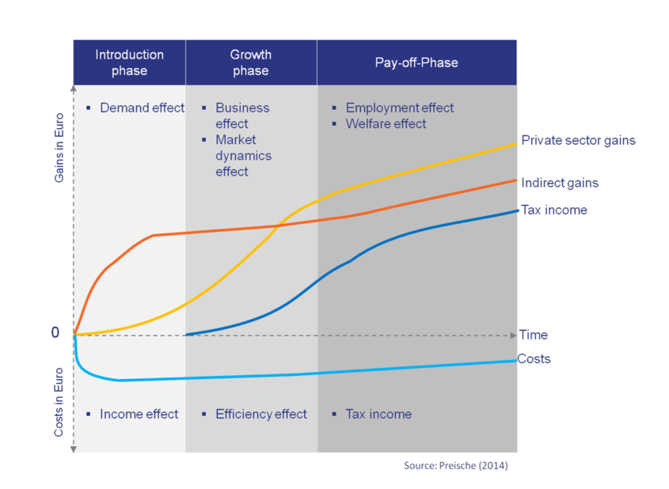]

---
### Pour permettre le développement de  nouveaux services

[](http://citizenclan.org)

---
### Pour permettre le développement de  nouveaux services

[](http://handisco.com)

---
### Pour améliorer l’efficience des services 

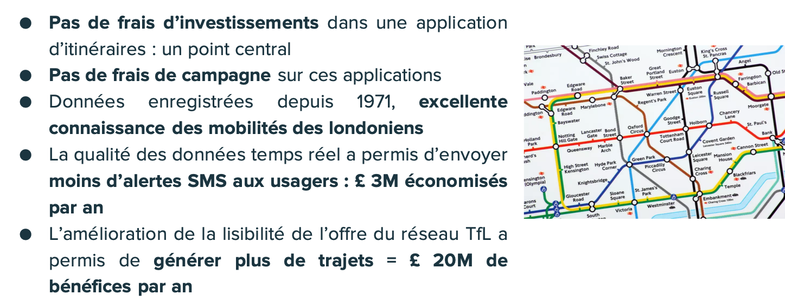

---
class: inverse, center, middle

# Les facteurs clés de succès d'un projet d'open data 

---
class: inverse, center, middle

# Merci !

Contact : [joel@datactivist.coop](mailto:joel@datactivist.coop)


